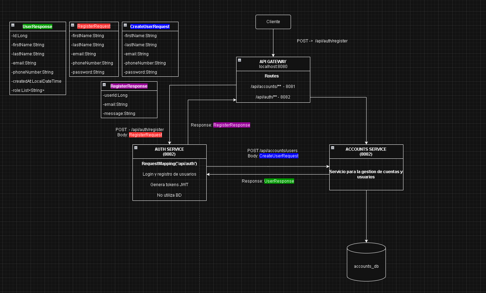
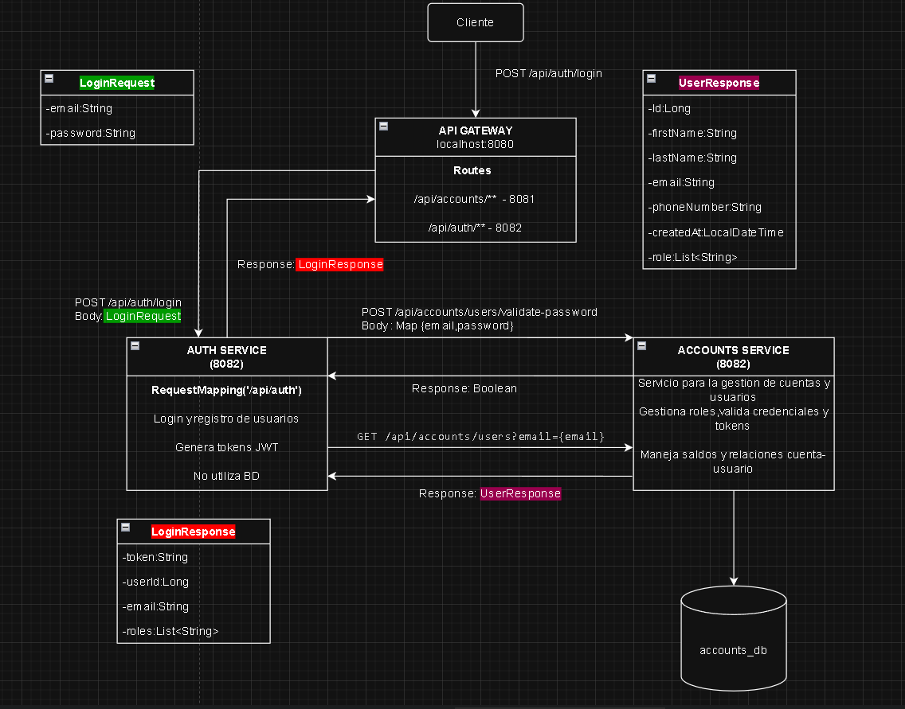
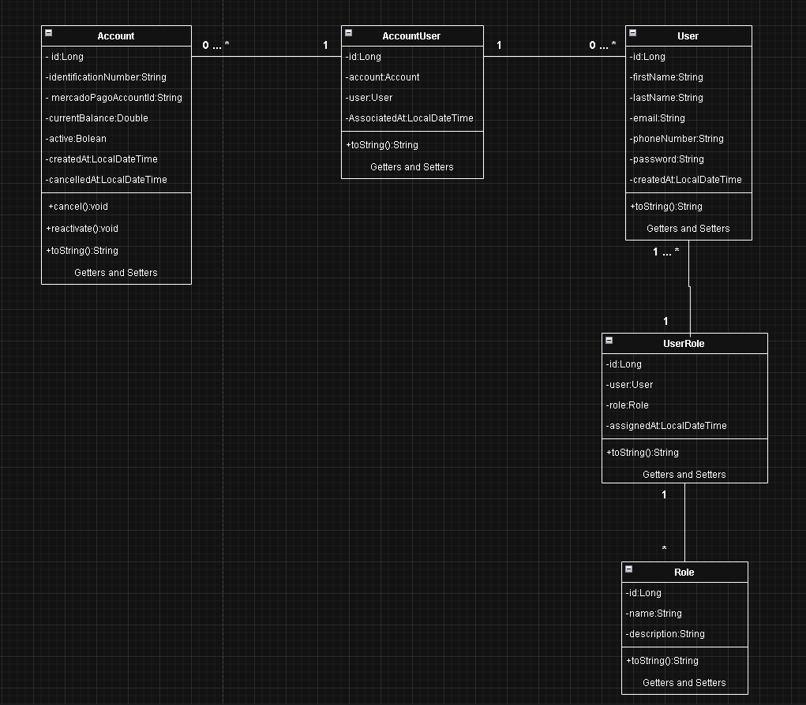

# TP4 Arquitectura - Primera Parte

### Integrantes 

Grupo 3: Juan Encabo & Matias Bidinos. Microservicio asignado: Usuarios y Roles.

### Configuracion 
El applicacion properties "TP4_Arquitectura_1Parte\accounts-services\src\main\resources\application.properties"
ya se encuentra configurado para la siguiente base de datos y usuario.

### Creacion de la Base de Datos y Usuario

```
CREATE DATABASE accounts_db CHARACTER SET utf8mb4 COLLATE utf8mb4_unicode_ci;

CREATE USER 'accounts_user'@'localhost' IDENTIFIED BY 'accounts_pass';

GRANT ALL PRIVILEGES ON accounts_db.* TO 'accounts_user'@'localhost';

FLUSH PRIVILEGES;
```

Ademas en el application.properties hay una opcion para activar o desactivar un seeder y poblar las tablas del proyecto

```app.seed.enabled=false```

### Roles

El proyecto cuenta con 3 roles según el TP:

- **`ROLE_USER`**: Usuarios del servicio que utilizan la aplicación móvil para alquilar monopatines.

- **`ROLE_EMPLOYEE`**: Encargados de Mantenimiento de monopatines.

- **`ROLE_ADMIN`**: Administrador del sistema.

### Urls

- **API Gateway**: http://localhost:8080
- **Accounts Service**: http://localhost:8081
- **Auth Service**: http://localhost:8082


### Swagger 

#### Accounts Service
- ** Swagger URL**: http://localhost:8081/swagger-ui/index.html

#### Auth Service
- ** Swagger URL**: http://localhost:8082/swagger-ui/index.html

### Postman 

Coleccion completa de endpoints para pruebas:
https://tp3777.postman.co/workspace/TP4_Arquitectura_1Parte~d658834b-273a-4759-b660-4c8abd34770f/collection/18011585-99695c1b-f5d7-4975-acff-f6970e8b341a?action=share&creator=18011585

### Archivos Readme

 [README de Accounts Service](accounts-services/README.md).


### Comunicacion entre servicios

#### Endpoint Register: `/api/auth/register`
Este endpoint (Register) se comunica con el servicio [accounts-service](accounts-services/) para registrar un usuario ya que este ultimo gestiona cuentas y usuarios.

**Nota:** En auth-service existen dos DTOs con los mismos atributos (RegisterRequest y CreateUserRequest). RegisterRequest es el que se utiliza del lado del cliente, tiene validaciones (@NotBlank, @Email) y recibe la contraseña en texto plano. CreateUserRequest se envía a accounts-service con la contraseña ya hasheada y tiene el mismo nombre que el DTO de accounts-service para mantener compatibilidad en la comunicación entre servicios. Esta separación permite mantener la responsabilidad de validación en auth-service mientras se respeta el contrato esperado por accounts-service.

<div align="center">
  
</div>

<hr>

#### Endpoint Login: `/api/auth/login`

Este endpoint (Login) se comunica con el servicio [accounts-service](accounts-services/) para autenticar un usuario y generar el token JWT.


<div align="center">
  
</div>

### Diagrama de clase de entidades

<div align="center">
  
</div>

